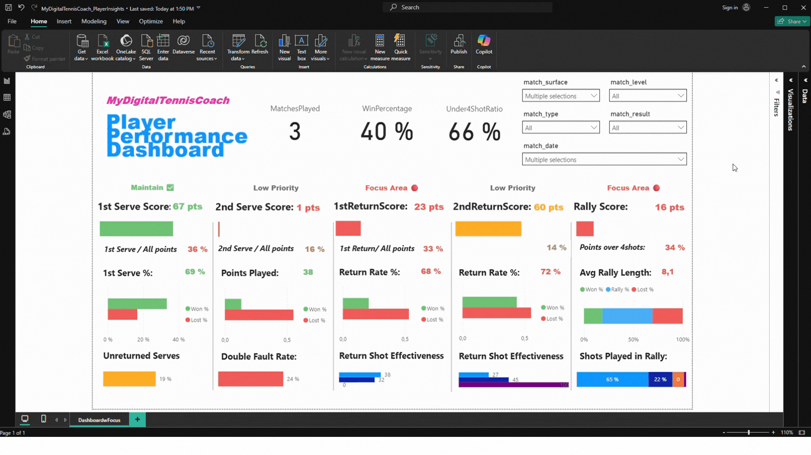

# Tennis Performance Dashboard (Power BI)

This repository demonstrates how match performance data can be processed, structured, and visualized to generate actionable insights for tennis players. It is a working replica of the [MyDigitalTennisCoach](https://apps.apple.com/de/app/my-digital-tennis-coach/id1631299737) app.

## 🔍 Project Overview

The dashboard is built using Power BI and helps players understand their match performance over time. It supports filtering and slicing by:

- Date range
- Opponent level
- Match type (e.g., tournament, practice)
- And more

The goal is to help players identify strengths, weaknesses, and training priorities.



---

## 📁 Folder Structure

```
├── core_stats.csv             # Aggregated player stats per match  
├── match_info.csv             # Metadata about each match (opponent, level, etc.)  
├── raw_data/                  # Raw input data files (e.g., from IoT or match logs)  
├── backup/                    # Automatic backups of previous core_stats and match_info  
├── img/                       # images for readMe  
├── process_match_data.py      # Python script for transforming and appending new data  
├── powerbi/  
│   └── TennisDashboard.pbix   # Power BI file with visualizations and filters  
```

---

## ⚙️ How It Works

1. **Data Processing**  
   Run `process_match_data.py` to:
   - Transform raw input files from `raw_data/`
   - Append to existing `core_stats.csv` and `match_info.csv`
   - Create backups of the original files in the `backup/` folder

2. **Visualization**  
   Open `TennisDashboard.pbix` (in the `powerbi/` folder) with [Power BI Desktop](https://powerbi.microsoft.com/desktop/) to explore:
   - Aggregated match stats
   - Trends over time
   - Filters and slicers for deep analysis

---

## 🧪 Demo Use

This project is designed to be shared in interviews and applications. You can download this repo and explore the `.pbix` file directly in Power BI Desktop—**no external data sources or setup required**.

---

## 📌 Notes

- Data files are small and self-contained.
- The `.pbix` is fully functional and uses imported data.
- No Premium license or Power BI Service required to view or interact with the dashboard.

---

## 🧠 Key Skills Demonstrated

- Data transformation with Python
- Dashboard creation in Power BI
- Interactive filtering and visual storytelling
- Data pipeline automation and backup


